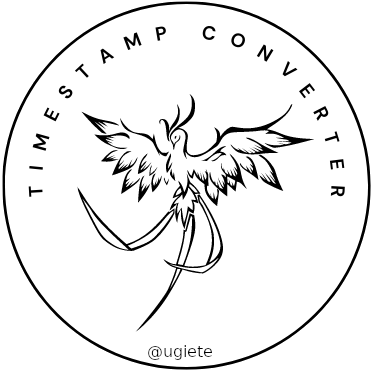

<br />
<p align="center">
  <a href="https://github.com/ugiete/Timestamp-Converter">
    
  </a>

  <h3 align="center">Timestamp Converter</h3>

  <p align="center">
    An UNIX Timestamp ⇄ Date Time using Elixir Phoenix
    <br />
    <a href="https://github.com/ugiete/Timestamp-Converter/issues">Report Bug</a>
    ·
    <a href="https://github.com/ugiete/Timestamp-Converter/issues">Request Feature</a>
  </p>
</p>

<details open="open">
  <summary>Table of Contents</summary>
  <ol>
    <li>
      <a href="#about-the-project">About The Project</a>
      <ul>
        <li><a href="#built-with">Built With</a></li>
      </ul>
    </li>
    <li>
      <a href="#getting-started">Getting Started</a>
      <ul>
        <li><a href="#prerequisites">Prerequisites</a></li>
        <li><a href="#installation">Installation</a></li>
      </ul>
    </li>
    <li>
        <a href="#usage">Usage</a>
        <ul>
            <li><a href="#brownsable-api">Brownsable API</a></li>
            <li><a href="#json-api">JSON API</a></li>
      </ul>
    </li>
    <li><a href="#roadmap">Roadmap</a></li>
    <li><a href="#contributing">Contributing</a></li>
    <li><a href="#license">License</a></li>
    <li><a href="#contact">Contact</a></li>
    <li><a href="#acknowledgements">Acknowledgements</a></li>
  </ol>
</details>

## About The Project

Timestamp converter is a Phoenix project based on [freeCodeCamp](https://freecodecamp.org) API and Microservices challenge [Timestamp Microservice](https://www.freecodecamp.org/learn/apis-and-microservices/apis-and-microservices-projects/timestamp-microservice).

This project has two main goals: For me is an opportunity to show my skills building an simple Phoenix microservice, and for the general public to have an entrypoint to start learning Elixir. With this project, one could edit and publish their own version or maybe utilize some (or all) functions presented here to convert timestamps to various scenarios.

### Built With

* [Elixir](https://elixir-lang.org/)
* [Phoenix](https://www.phoenixframework.org/)

## Getting Started

This project was made with Ubuntu 20.04, so the documentation will describe how to install and run in a Ubuntu/Debian environment, I hope to add more details of how to utilize it in other platforms later.

### Prerequistes

This is an Elixir Phoenix app, so you need both installed, as we also need Node.js as Phoenix use [webpack](https://webpack.js.org/) to compile the static assets.

Elixir runs in top of the BEAM (Erlang Virtual Machine) so we need to install erlang too.

```sh
# ERLANG AND ELIXIR INSTALLATION (UBUNTU / DEBIAN)
# Other platforms installation guide at https://elixir-lang.org/install.html

# Add Erlang Solution repo
wget https://packages.erlang-solutions.com/erlang-solutions_2.0_all.deb && sudo dpkg -i erlang-solutions_2.0_all.deb
sudo apt-get update

# Install Erlang/OTP
sudo apt-get install esl-erlang

# Install Elixir
sudo apt-get install elixir

# Install Hex package manager
mix local.hex
```

```sh
# PHOENIX INSTALLATION (UBUNTU / DEBIAN)

# inotify-tools is a filesystem watcher, useful to automatically reload the page while developing
sudo apt-get install inotify-tools

# Phoenix app generator
mix archive.install hex phx_new 1.5.9
```

```sh
# NODE INSTALLATION (UBUNTU 20.04)
# Other platforms installation guide at https://nodejs.org/en/

sudo apt-get update
sudo apt-get install nodejs

# Phoenix needs version 5.0.0 or greater
node -v
npm -v
```
## Usage

To start your Phoenix server:

  * Install dependencies with `mix deps.get`
  * Install Node.js dependencies with `npm install` inside the `assets` directory
  * Start Phoenix endpoint with `mix phx.server`

Now you can visit [`localhost:4000`](http://localhost:4000) from your browser.

### Brownsable API

The timestamp converter has a graphic interface in the [`root`](http://localhost:4000) built with Phoenix LiveView.

To convert an UNIX timestamp to readable date time, add the desired timestamp in the first input field then click CONVERT. You must add the timestamp in milliseconds.

To convert a date time to UNIX timestamp, put the date in the second input field then click CONVERT. The input date time must have the follow format: dd/MM/yyyy HH:mm:ss, and the timezone is GMT.

#### Notes

* The CLEAR button, clears the **already** converted fields;
* The converter has operation preference:
    1. Timestamp → Date Time
    2. Date Time → Timestamp
    * So if both inputs are given, timestamp to date time will be applied.

### JSON API

It also provides a JSON API

* Timestamp → Date Time
    * [`/api/ts/:timestamp`](http://localhost:4000/api/ts/824854020000)
    * :timestamp = _integer_
    * Responses
        * {"unix":824854020000,"utc":"Tur, 20 Feb. 1996 22:07:00.000 GMT"}
        * {"error":"Invalid Timestamp"}
* Date Time → Timestamp
    * [`/api/ts/:datetime`](http://localhost:4000/api/dt/20-02-1996T22:07:00)
    * :datetime = _dd-MM-yyyy_<span style="color:red">*T*</span>_HH:mm:ss_
    * Responses
        * {"unix":824854020000,"utc":"Tur, 20 Feb. 1996 22:07:00.000 GMT"}
        * {"error":"Invalid Date"}

## Roadmap

See the [open issues](https://github.com/othneildrew/Best-README-Template/issues) for a list of proposed features (and known issues).

## Contributing

Contributions are what make the open source community such an amazing place to be learn, inspire, and create. Any contributions you make are **greatly appreciated**.

1. Fork the Project
2. Create your Feature Branch (`git checkout -b feature/AmazingFeature`)
3. Apply elixir's standart format (`mix format`)
4. Check your code quality (`mix credo`)
5. Commit your Changes (`git commit -m 'Add some AmazingFeature'`)
6. Push to the Branch (`git push origin feature/AmazingFeature`)
7. Open a Pull Request

## License


Distributed under the MIT License. See `LICENSE` for more information.

## Contact

Feel free to send messages, suggestions, etc. I would love to talk about Elixir, Phoenix, Backend develpment, Data Science and especially soccer :)


[`Leonardo Silva Ugiete`](www.linkedin.com/in/ugiete) - leonardougiete@hotmail.com

Project Link: [Timestamp-Converter](https://github.com/ugiete/Timestamp-Converter)

## Acknowledgements
* [Floki](https://github.com/philss/floki)
* [Gettext](https://github.com/elixir-gettext/gettext)
* [Jason](https://github.com/michalmuskala/jason)
* [Credo](https://github.com/rrrene/credo)
* [Best-README-Template](https://github.com/othneildrew/Best-README-Template)

